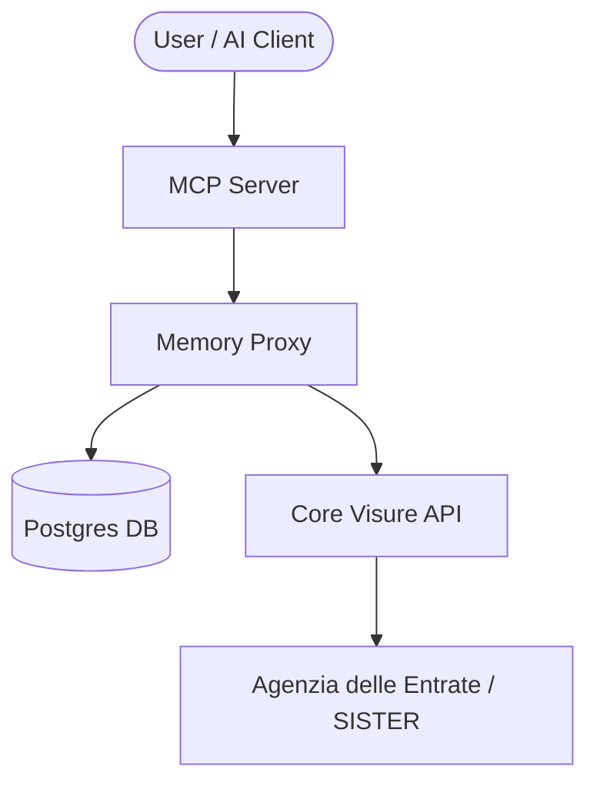

# Catasto Assistant

Integrated environment combining all Visura API components into a single, high-performance stack.

## Architecture



## Quick Start

1. **Configure API Credentials**:
   Ensure you have configured your credentials in the root `.env` file (see root `README.md`).

2. **Start the Stack**:
   ```bash
   cd catastoAssistant
   docker compose up -d
   ```

3. **Verify Health**:
   - **Integrated Proxy (Cached)**: `http://localhost:8002/health` (Main entry point)
   - **Integrated MCP Service**: `http://localhost:8001` (AI entry point)
   - **Internal Core API**: `http://localhost:8004/health` (For debugging only)

## Modular Roles

- **Core API**: Handles the heavy lifting of browser automation and scraping.
- **Memory Proxy**: Caches results for 365 days (default) to ensure sub-millisecond responses for known properties. It acts as a resilient buffer.
- **MCP Server**: Provides a standardized interface for AI assistants to query the cached stack efficiently.

## Configuration overrides


## Database Access

The integrated stack simplifies data persistence by sharing a single PostgreSQL instance for all components.

- **Host**: `localhost`
- **Port**: `5433` (mapped from 5432)
- **Database**: `visura_cache`
- **User/Password**: Defined in your root `.env` (defaults: `appuser` / `apppass`)

For detailed schema info and query examples, refer to [memory/README.md](../memory/README.md).
